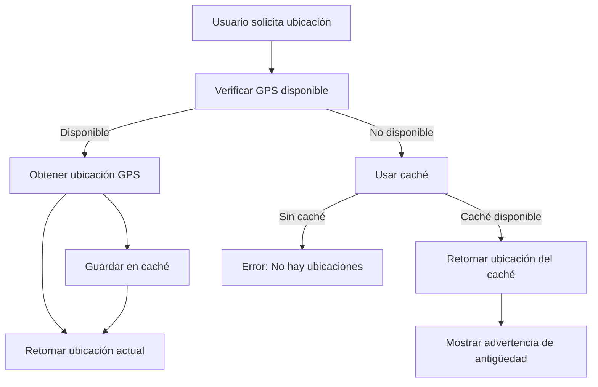

# 📍 Sistema de Geolocalización Offline

## ✅ **¿Qué se ha implementado?**

Se ha creado un **sistema robusto de geolocalización que funciona incluso sin conexión a internet**, resolviendo el problema donde la ubicación no se podía obtener cuando no había internet.

## 🔧 **Componentes del Sistema**

### 1. **GeoLocationService** (`/src/services/geoLocationService.js`)
- **Servicio principal** que maneja toda la lógica de geolocalización
- **Caché inteligente** que guarda ubicaciones en localStorage
- **Fallback automático** a ubicaciones guardadas cuando GPS no está disponible
- **Inicialización silenciosa** para tener siempre una ubicación de respaldo

### 2. **Integración en Home.vue**
- **Funciones actualizadas**: `getUbicacion()` y `getUbicacionRegistro()`
- **Uso del nuevo servicio** en lugar de `navigator.geolocation` directamente
- **Mensajes informativos** cuando se usa ubicación del caché

## 🌟 **Características Principales**

### ✅ **Funciona Offline**
- Obtiene ubicación incluso sin conexión a internet
- Usa ubicaciones guardadas previamente como fallback
- Guarda automáticamente las ubicaciones obtenidas

### ✅ **Caché Inteligente**
- Almacena hasta 50 ubicaciones recientes
- Guarda en localStorage para persistencia
- Muestra antigüedad de la ubicación ("hace 5 minutos")

### ✅ **Fallback Robusto**
```javascript
// Estrategia de fallback:
1. Intentar GPS actual (10 segundos)
2. Si falla → Usar ubicación en caché
3. Si no hay caché → Mostrar error
```

### ✅ **Inicialización Automática**
- Al cargar la app, obtiene ubicación silenciosamente
- Esto asegura que siempre haya una ubicación de respaldo
- No muestra errores al usuario durante la inicialización

## 📱 **Experiencia del Usuario**

### **Con Internet:**
1. Usuario presiona "Obtener ubicación (funciona offline)"
2. Sistema obtiene ubicación del GPS
3. ✅ "Ubicación obtenida del GPS"

### **Sin Internet (Primer caso):**
1. Usuario presiona "Obtener ubicación (funciona offline)"
2. GPS no está disponible
3. Sistema usa ubicación del caché
4. ⚠️ "Usando ubicación guardada (hace 5 minutos). GPS no disponible."

### **Sin Internet (Sin caché):**
1. Usuario presiona "Obtener ubicación (funciona offline)"
2. Sin GPS y sin caché
3. ❌ "No se pudo obtener ubicación y no hay ubicaciones en caché"

## 🔄 **Flujo de Sincronización**



## 🚀 **Beneficios**

### **Para Registros Offline:**
- ✅ Los usuarios pueden crear registros incluso sin internet
- ✅ Ubicación se obtiene del caché local
- ✅ Todo se sincroniza cuando vuelve la conexión

### **Para Asistencia Offline:**
- ✅ Entrada/Salida funcionan sin conexión
- ✅ Ubicación guardada localmente
- ✅ Sincronización automática al recuperar internet

### **Para la App en General:**
- ✅ Experiencia fluida sin interrupciones
- ✅ Menor dependencia de conexión a internet
- ✅ Feedback claro al usuario sobre el estado

## 🛠 **API del Servicio**

### **Métodos Principales:**

```javascript
// Obtener ubicación con estrategia inteligente
const location = await geoLocationService.getLocationSmart({
  timeout: 12000,
  enableHighAccuracy: true,
  useCache: true
});

// Obtener última ubicación conocida
const lastLocation = geoLocationService.getLastKnownLocation();

// Verificar si hay ubicación válida en caché
const hasValidCache = geoLocationService.hasValidCachedLocation();

// Obtener estado del servicio
const status = geoLocationService.getStatus();
```

### **Propiedades de Respuesta:**

```javascript
{
  latitude: -20.123456,
  longitude: -70.654321,
  accuracy: 10,
  timestamp: 1672531200000,
  fromCache: true  // Indica si viene del caché
}
```

## 📊 **Configuración**

### **Parámetros por Defecto:**
- **Timeout**: 12 segundos
- **Alta precisión**: Habilitada
- **Edad máxima del caché**: 1 hora
- **Tamaño máximo del caché**: 50 ubicaciones

### **Personalización:**
```javascript
const location = await geoLocationService.getCurrentLocation({
  timeout: 8000,           // Timeout personalizado
  enableHighAccuracy: false, // Menor precisión para mayor velocidad
  maximumAge: 600000,      // Aceptar ubicaciones de hasta 10 minutos
  useCache: false          // No usar caché como fallback
});
```

## 🔍 **Debugging**

### **Logs en Consola:**
- `📍 Ubicación inicial obtenida silenciosamente`
- `📍 Usando ubicación del caché (hace 5 minutos)`
- `📍 Ubicación obtenida del GPS`

### **Estados en localStorage:**
- `geoLocationCache`: Datos de ubicaciones guardadas
- Incluye `lastKnownLocation` y `locationCache`

## ✨ **Resultado Final**

**El sistema ahora garantiza que:**
1. ✅ **Siempre se puede obtener una ubicación** (con caché como fallback)
2. ✅ **Los registros offline funcionan completamente** 
3. ✅ **La experiencia es fluida** sin errores de geolocalización
4. ✅ **Se sincroniza automáticamente** cuando hay conexión
5. ✅ **Información clara al usuario** sobre el origen de la ubicación

**¡La funcionalidad offline de ubicación está completamente implementada y funcional!** 🎉
